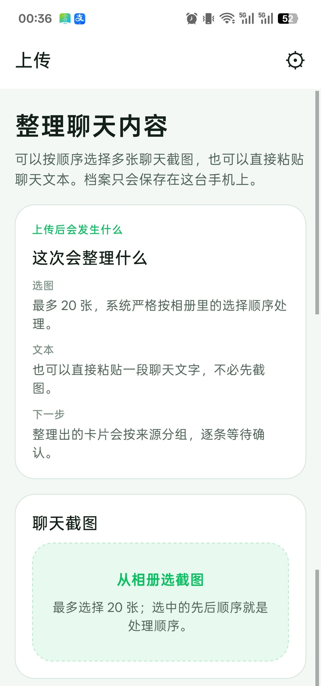
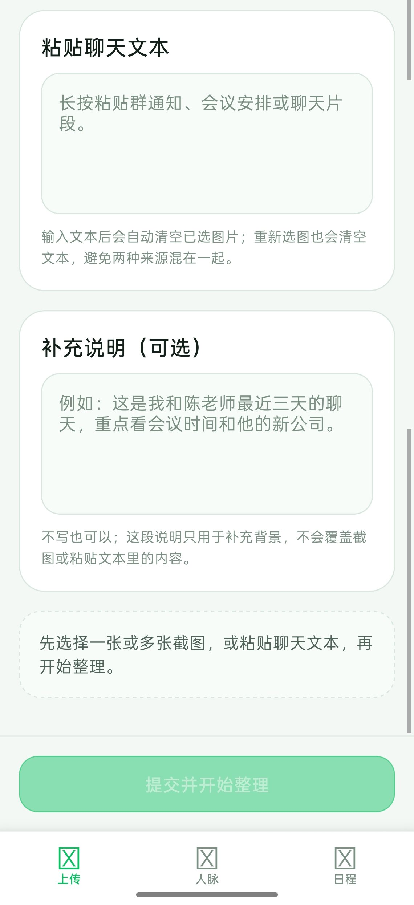
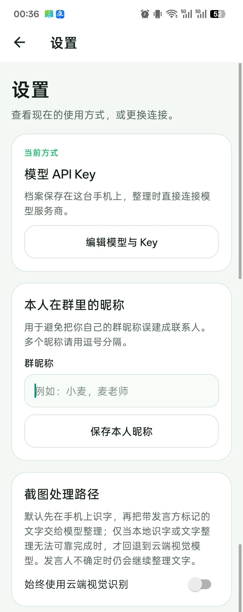
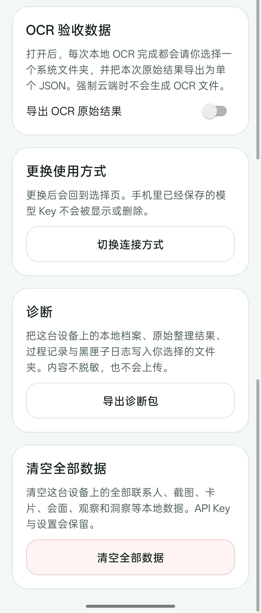
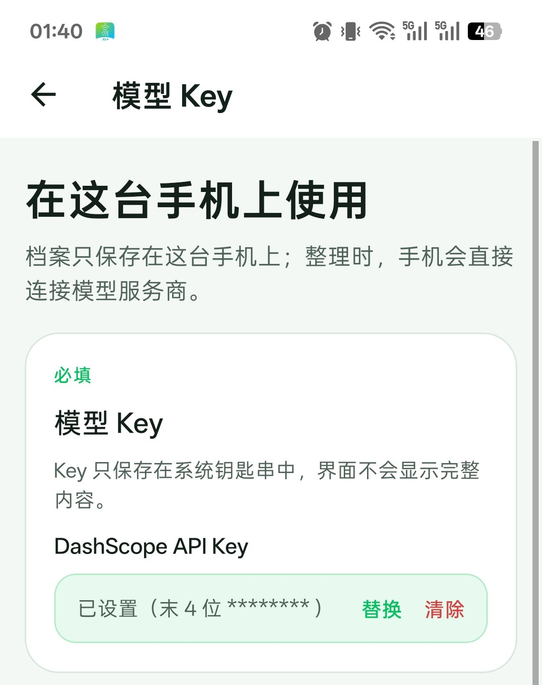
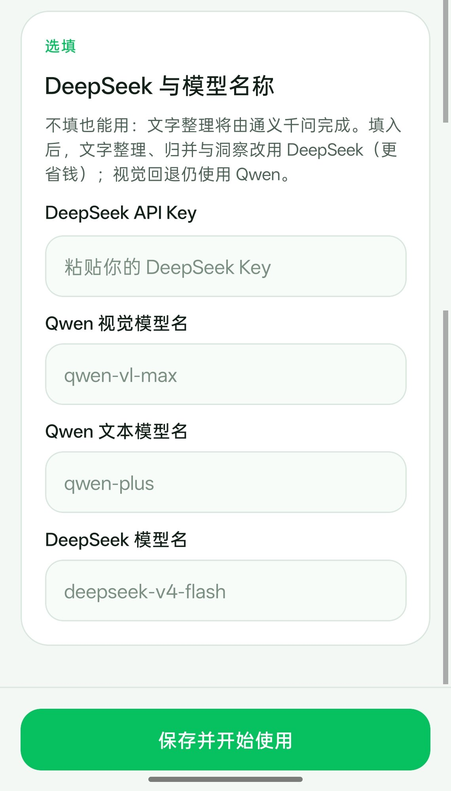

# 脉络 Mailuo

英文版：[README_EN.md](README_EN.md)

脉络 Mailuo 把聊天截图变成结构化行动卡片、联系人记忆和有依据的关系洞察。

**下载**：最新 Android 安装包（BYOK 单机版）在 [GitHub Releases](https://github.com/AliceLJY/mailuo/releases/latest)。

v3 把识字与理解分开：Android 原生 BYOK 模式先由本地 OCR 读取截图，再由所配置的文本模型把带标注的文字整理成结构化证据；除非用户明确强制云端视觉，视觉模型只做回退。

当前事项流程支持四件事：无联系人或会议时间也能独立成事项；相似事项先给查重提示，再由用户确认更新；群聊推进碎片可保守挂靠到已有事项；相对时间只在截图中有明确绝对时间戳时锚定，否则留空。

**Android 真机界面**（BYOK 单机版，截自 v3.1.15）。上传、设置与模型 Key 页是整页滚动截图，分段展示：

| 上传 · 上半 | 上传 · 下半 | 设置 · 上半 | 设置 · 下半 |
|---|---|---|---|
|  |  |  |  |

| 首次启动选择 | 模型 Key · 上半 | 模型 Key · 下半 |
|---|---|---|
|  |  |  |

| 人脉档案 | 日程 |
|---|---|
|  |  |

> 人脉与日程为 web 版界面（Expo web 输出），图中人物、公司均为合成测试数据；原生版界面一致。

## 架构

```text
Android BYOK 本地模式（默认）

截图
  -> 本机 ML Kit OCR
  -> 带标注文本（发言方 + 时间戳锚点）
  -> 所配置的文本模型
  -> 结构化人物 / 事项 / 事实 / 引用
  -> 归并 + 可编辑提议
  -> 人工确认
  -> 本地 SQLite + 有依据的洞察
```

如果本地 OCR 无法产出可靠文字、文字理解失败，或用户明确强制云端视觉，截图才会走 Qwen-VL 视觉回退，再回到同一条归并与提议链路。web 与自部署 server 模式上传的截图仍走服务端 Qwen-VL 视觉感知。

Android 本地健康路径中，原始截图留在手机上；所配置的文本模型接收的是带标注的 OCR 文字，不是图片。DeepSeek 为选填项；未配置时，文本任务通过 DashScope 使用 Qwen。

## Agent 环

1. 识字：Android 本地模式用 ML Kit OCR 读取截图；只有文字路径不可用或用户强制云端视觉时才回退 Qwen-VL。粘贴文本跳过图片识别，web 与 server 的截图上传走 Qwen-VL 感知。
2. 理解：所配置的文本模型把带标注的 OCR 文字或粘贴文本整理成结构化人物、事项、事实与引用。
3. 归并：先用 canonical name 和 aliases 精确命中已有联系人；失败时才让文本模型判断 `same_as`、`new` 或 `unsure`。经确认的称呼会写回 aliases，供后续批次本地命中。本人在群里的昵称可在设置里登记，避免把自己的发言建成联系人。
4. 提议：生成联系人变更、会议、行程、独立事项、事项更新和互动记录等可编辑卡片。相似事项只提示用户确认更新，不自动去重。互动记录只记本人主动发起的往来：纯应答、被别人 @ 到、到达通报，以及围绕已成卡会议的后勤沟通都不会成卡。
5. 人工确认：用户可以编辑字段、处理歧义、确认、跳过或拒绝每张卡。整批可以乱序处理，跳过的卡可以恢复；跳过新建联系人时会提示还有哪些互动卡依赖它。
6. 执行：把确认后的联系人、会议与事项、别名和 observations 写回 SQLite。确认过的会议和联系人之后仍可编辑、删除；删除联系人会一并清掉其观察记录与洞察，并从卡片和会议里解除关联。
7. 有依据的洞察：生成关系解读、建议行动和话头，每条都必须引用 `based_on` observation 证据。

这不是一个套壳产品，证据有三点：

- 系统返回的是结构化、可执行的卡片，不是一段自由文本。
- 人物归并会把别名裁决写回 memory，联系人档案会越用越准。
- 每条洞察都必须落在已存 observation 上，而不是只看一张截图即兴发挥。

## Memory 设计

脉络 Mailuo 把 memory 设计映射到 Atkinson-Shiffrin 模型：感觉记忆、工作记忆、长期记忆。

| 层 | 存储单元 | 生命周期 | 对应关系 |
| --- | --- | --- | --- |
| 感觉层 | `screenshots` 表的 `raw_extraction` 列 | 感知完成后主要用于溯源 | 感觉记忆 |
| 工作层 | `action_cards` 里处于 `pending` 状态的记录 | 等待用户确认或拒绝 | 工作记忆 |
| 长期层 | `contacts`、`observations`、`meetings`（会议、行程与独立事项）、`insights` 中持续累积的记录 | 持续累积 | 长期记忆 |

长期记忆内部有两种更新语义：

- 档案字段：结构化 `Contact` 列变化慢，只在用户确认后更新。被确认的变更还会留下 `Observation` 轨迹。
- 流水事实：`Observation` 只追加不回写，每条都锚定原文和时间。

这个拆分让模型既能用档案字段回答“这个人是谁”，也能用 observation 时间线回答“关系怎样在变化”。

## 工程故事

这个项目通过自动化测试、真实模型检查和真机测试持续打磨。

- 自动化覆盖 schema 迁移、OCR 与视觉回退、批次顺序、提议与归并、独立事项、查重更新、时间戳锚点、路由行为和有依据的洞察。
- 真实模型检查抓出过 mock 未覆盖的 prompt 问题，包括把自己的发言建成联系人、把公司变更塞进 notes、把模糊时间生成为会议，以及截断洞察 JSON。
- iOS 与 Android 测试发现过原生文件上传和 OCR runtime 加载问题；web 测试也覆盖了跨域开发与同源部署的差异。
- 真机迭代：v3.1.7 到 v3.1.15 由 app 导出到用户自选文件夹的诊断包驱动（行动卡、逐截图 trace、事件日志、退出原因、Java 崩溃堆栈，不上传任何内容）；互动记录规则按用户每轮实际拒掉的卡逐轮收紧。

## 快速开始

前提是 Node 26 或更高版本。

1. 安装依赖。

```bash
cd server
npm install
```

```bash
cd app
npm install
```

2. 准备环境变量文件。

```bash
# server/.env
DASHSCOPE_API_KEY=
QWEN_MODEL=qwen-vl-max
QWEN_TEXT_MODEL=qwen-plus
# 选填：留空时，归并与洞察会通过 DashScope 使用 Qwen。
DEEPSEEK_API_KEY=
DEEPSEEK_MODEL=deepseek-v4-flash
PORT=3000
```

只有 DashScope Key 是必填项。填写 DeepSeek Key 后，归并与洞察会改用 DeepSeek；不填则继续使用 Qwen。

```bash
cp app/.env.example app/.env
```

```bash
# app/.env
EXPO_PUBLIC_API_URL=http://<你的局域网 IP>:3000
```

如果要走同源 web 部署，执行 `bash scripts/build-web.sh` 时会强制把 `EXPO_PUBLIC_API_URL` 置空，让打包后的客户端固定走 `/api`。

3. 在仓库根目录打开两个终端，分别启动服务端和应用。

```bash
# 终端 1
cd server
npm run dev
```

```bash
# 终端 2
cd app
npm run start
```

4. 构建用于同源部署的 web 产物。

```bash
bash scripts/build-web.sh
```

这个脚本会以同源 API 路径导出 web 版，并同步到 `server/public/`。

## 构建与部署文档

构建和部署入口在 [deploy/README.md](deploy/README.md) 和 [scripts/build-web.sh](scripts/build-web.sh)。仓库里包含 `launchd` plist、安装脚本、Tailscale Serve 示例，以及 Expo EAS 预览 APK 配置。自部署仍需在目标主机上手动执行。

## 隐私边界

- **BYOK 本地模式**：档案与导入的截图文件只保存在用户手机本地；推理时由 app 直接连接模型服务商，全程没有脉络中间服务器。模型 Key 只存入系统钥匙串（iOS Keychain / Android Keystore），界面永远不会回显全文。
- Android 默认 OCR 路径中，原始截图留在手机上；带标注的识别文字会发给所配置的文本模型，用于抽取与归并。
- 本地 OCR 无法产出可靠文字、文字理解失败或用户强制云端视觉时，原始截图会发给 Qwen-VL 做视觉回退，但不会发给 DeepSeek。
- 自部署 server 模式的数据存放在服务端主机本地 SQLite，截图文件存放在 `server/data/screenshots/`；截图感知使用 Qwen-VL。
- 诊断包与 OCR 原始结果只写入你在设备上选择的文件夹，不会上传。
- **通过「粘贴文本」入口提交的内容，会原样发送给所配置的文本模型**（DeepSeek，或未配置 DeepSeek 时的 DashScope Qwen 文本模型）用于抽取，不经过视觉模型。粘贴什么就发送什么，请自行判断内容敏感度。
- DeepSeek 只接收文字整理、人物归并或有依据洞察所需的文本，例如 `source_quote`、`facts`、`quotes`、`events`，以及最小档案或 observation 上下文。未配置 DeepSeek 时，上述文本任务由 DashScope 的 Qwen 文本模型完成，数据不发往 DeepSeek。
- **说白了**：数据存储在本地，但推理时，OCR 文字或粘贴文本会到达所配置的文本模型；只有视觉回退、强制云端视觉或 server 模式的视觉感知会把原始截图发往阿里云。模型服务商的数据政策仍然适用。
- **全本地路线（架构已支持，改环境变量即可）**：两个 provider 均走 OpenAI 兼容接口，可直接指向本地推理服务（如 Ollama / vLLM）——设置 `DASHSCOPE_BASE_URL` / `DEEPSEEK_BASE_URL` 指向本机端点、`QWEN_MODEL` / `DEEPSEEK_MODEL` 换成本地模型（视觉可用开源 Qwen-VL 系列），即可实现数据全程不出本机。注意本地小模型的抽取与洞察质量会相应下降，请自行评估。
- 当前部署还是单用户，没有应用层鉴权。
- 现在的实际访问边界取决于部署者选择的局域网或 Tailscale 暴露范围。
- 面向多用户的鉴权和隔离仍是后续工作。

## 已知限制

- 本地 OCR 仍可能认错字，重要字段应在确认卡上人工核对。
- 事项查重有意采用保守判据，可能漏掉相似项。整张截图尚未去重，重复上传仍可能重复累计 observations。
- OCR 认成形近字的名字不做自动纠正，建议把变体登记为别名，或在设置里登记为本人昵称。
- 事项在多张截图之间的拆分与合并并不完全确定；同批重复项按原文相似度保守合并，保留先出的卡并并入另一张的日期。

## 使用方式

一个安装包提供①**API Key 本地模式**，用户填自己的模型 Key，整套处理在原生 app 内运行；②**自部署服务器模式**，连接用户自己的脉络后端；③灰色禁用的**订阅服务**占位，标注“敬请期待”。网页版仅支持服务器模式，本地模式为原生 app 专属。

## 后续工作

- iOS 原生分发：当目标地区的 App Store 不提供 Expo Go 时，iOS 原生分发需要 Apple Developer 账号，再配合 EAS 和 TestFlight。
- 整张截图的重复检测与合并。
- 洞察重试端点。
- 洞察定时主动推送。
- 系统日历集成。
- 消息应用直连。
- 群聊与多人参与场景优化。
- 多用户与鉴权。
