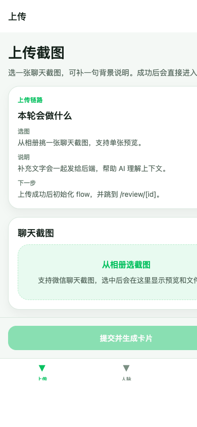
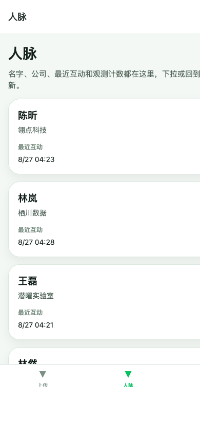
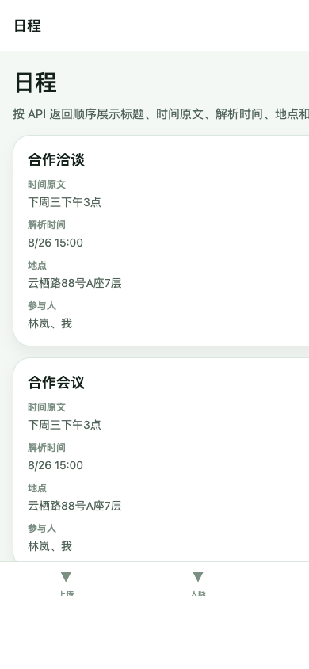
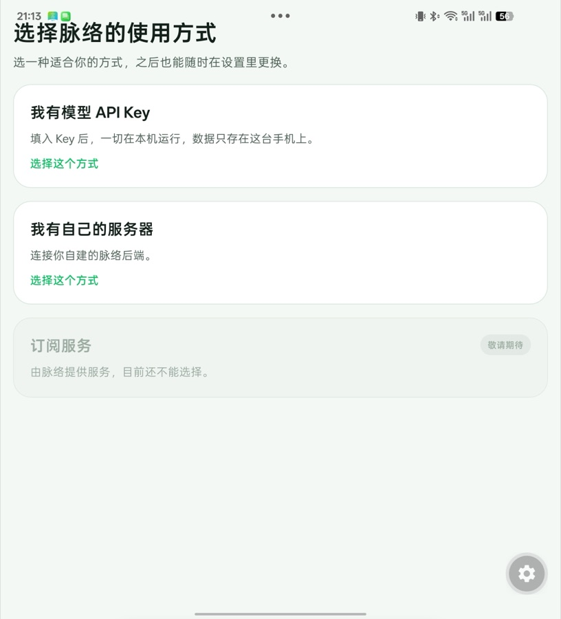
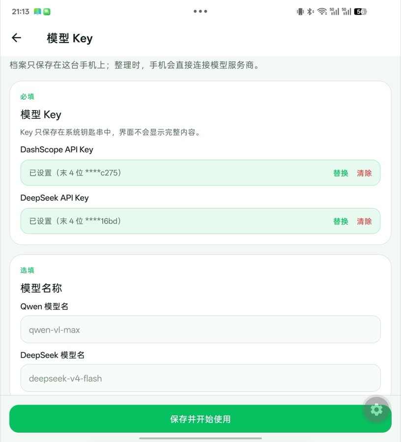
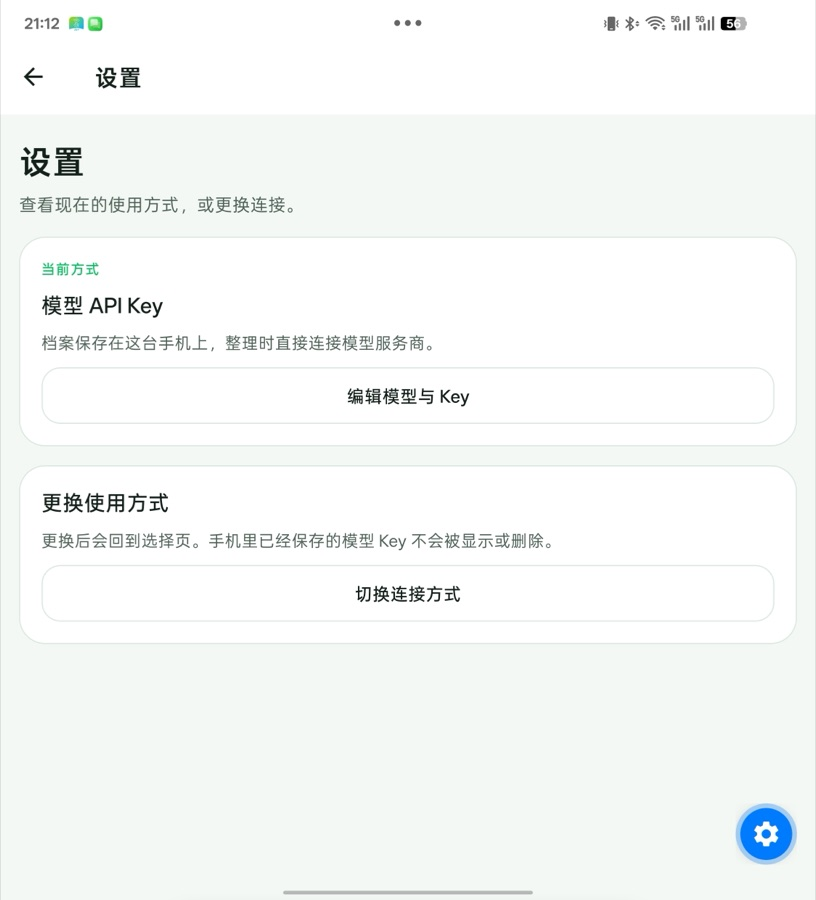

# Mailuo

Chinese Version: [README_CN.md](README_CN.md)

Mailuo turns chat screenshots into structured action cards, contact memory, and grounded relationship insights.

| Upload | Contacts | Meetings |
|---|---|---|
|  |  |  |

> Screenshots show the web build (Expo web output); the Android native UI is identical. All people and companies shown are synthetic test data.

**v2 dual-mode UI on a real device** (Android, BYOK standalone):

| First-launch chooser | Model key management | Settings |
|---|---|---|
|  |  |  |

## Architecture

```text
+--------------------------------+
| App                            |
| - iOS PWA                      |
| - Android native               |
| - upload / review / contacts   |
| - meetings                     |
+----------------+---------------+
                 |
                 | HTTPS / /api
                 v
+----------------+---------------+
| Server                         |
| - Fastify                      |
| - node:sqlite (DatabaseSync)   |
| - local screenshot storage     |
+--------+---------------+-------+
         |               |
         | screenshot    | minimal contact context
         v               v
+--------+-------+   +---+-----------------------+
| Qwen-VL        |   | DeepSeek                  |
| perception     |   | resolution & insights     |
| qwen-vl-max    |   | deepseek-v4-flash         |
+----------------+   +---------------------------+
```

Only Qwen receives raw screenshot binaries. DeepSeek never receives raw image files, but it does receive the extracted text needed for each task: screenshot-derived `source_quote`, `facts`, `quotes`, and `events`, plus the minimum contact summary needed for resolution or the profile and observation context needed for grounded insights.

## Agent Loop

1. Perception: send the screenshot and optional note to Qwen-VL and get structured extraction JSON.
2. Resolution: match people against existing contacts by canonical name or aliases first, then ask DeepSeek to decide `same_as`, `new`, or `unsure` when exact matching fails.
3. Proposal: turn the extraction into editable action cards such as `create_contact`, `update_contact`, `create_meeting`, and `record_interaction`, each with `confidence` and `source_quote`.
4. Human confirmation: let the user edit fields, resolve ambiguities, confirm, or reject each card.
5. Execution: write confirmed contacts, meetings, aliases, and observations back to SQLite.
6. Grounded insights: generate relationship reads, suggested actions, and conversation hooks that must cite `based_on` observation evidence.

Three signals that this is not a thin wrapper:

- The system returns structured, executable cards instead of a free-form paragraph.
- Entity resolution writes back alias decisions, so the contact memory becomes more accurate over time.
- Every insight is grounded in stored observations instead of being generated from the screenshot alone.

## Memory Model

Mailuo maps its memory stack to the Atkinson-Shiffrin model: sensory memory, working memory, and long-term memory.

| Layer | Storage units | Lifecycle | Mapping |
| --- | --- | --- | --- |
| Sensory layer | `screenshots.raw_extraction` | Kept mainly for traceability after perception | Sensory memory |
| Working layer | `action_cards` rows in `pending` state | Waits for user confirmation or rejection | Working memory |
| Long-term layer | `contacts`, `observations`, `meetings`, and `insights` rows | Persists and accumulates by person | Long-term memory |

Long-term memory has two update semantics:

- Profile fields: structured `Contact` columns change slowly and only after user confirmation. Confirmed changes also leave an `Observation` trail.
- Stream facts: `Observation` rows are append-only, each anchored to source text and time.

That split lets the model use profile fields for "who this person is" and observation timelines for "how the relationship is changing."

## Engineering Story

The project was hardened through a three-layer test funnel.

- Mock funnel: by the M4 handoff checkpoint, the suite had grown from 53 to 74 green cases across schema, proposal, resolution, execution, route behavior, and grounded insights.
- Current M4 baseline: the mock suite is now 87/87 green, with the added coverage focused on provider defaults, self-contact guards, partial upload cleanup, no-time-signal meeting folding, and same-origin static serving.
- Live model pass: owner testing with real keys exposed four prompt-layer failures that mocks had not covered yet. The system used to create a contact for the user's own self-side messages, push a company change into `notes` instead of `company`, turn "let's talk later" into a meeting without a time signal, and truncate insight JSON when the token ceiling was too small.
- Real devices: iPhone and Android surfaced two platform issues. Expo SDK 57 native uploads rejected legacy React Native `{ uri, name, type }` parts, so the app switched to standard `Blob` and `File`. The web client also needed CORS because the Metro dev server and the API server ran on different ports.

## Quickstart

Use Node 26 or newer.

1. Install dependencies.

```bash
cd server
npm install
```

```bash
cd app
npm install
```

2. Create the environment files.

```bash
# server/.env
DASHSCOPE_API_KEY=
QWEN_MODEL=qwen-vl-max
QWEN_TEXT_MODEL=qwen-plus
# Optional: when empty, resolution and insights use Qwen through DashScope.
DEEPSEEK_API_KEY=
DEEPSEEK_MODEL=deepseek-v4-flash
PORT=3000
```

Only the DashScope key is required. Add a DeepSeek key if you want resolution and insight generation to use DeepSeek instead of Qwen.

```bash
cp app/.env.example app/.env
```

```bash
# app/.env
EXPO_PUBLIC_API_URL=http://<your-lan-ip>:3000
```

For same-origin web serving, `bash scripts/build-web.sh` forces `EXPO_PUBLIC_API_URL` to empty during export so the bundled client uses `/api`.

3. From the repo root, open two terminals and start the server and app separately.

```bash
# Terminal 1
cd server
npm run dev
```

```bash
# Terminal 2
cd app
npm run start
```

4. Build the web bundle for same-origin serving.

```bash
bash scripts/build-web.sh
```

That exports the web app with a forced same-origin API base and syncs it into `server/public/`.

## Build And Deploy Docs

M4 build and deployment assets live in [deploy/README.md](deploy/README.md) and [scripts/build-web.sh](scripts/build-web.sh). The repo already includes a `launchd` plist, an install script, Tailscale serve instructions, and an Expo EAS preview APK profile, but the actual Mac mini deployment is still a manual owner step.

## Privacy Boundary

- **BYOK local mode**: profiles and imported screenshot files are stored only on the user's phone. During inference, the app connects directly to the model providers, with no Mailuo server in between. Model keys are kept only in the system credential store (iOS Keychain / Android Keystore), and the UI never reveals their full values.
- App data is stored locally in SQLite on the server host.
- Screenshot files are stored locally under `server/data/screenshots/`.
- Raw screenshot binaries are sent only to Qwen during perception.
- DeepSeek never receives raw images. For entity resolution it receives only the screenshot-derived text needed to decide identity, such as `source_quote`, `facts`, `quotes`, `events`, and the minimum contact summary. For insight generation it receives only the screenshot-derived text already stored as evidence plus the minimum profile and observation context needed for grounded output. When DeepSeek is not configured, these text tasks use the Qwen text model through DashScope instead, and no data is sent to DeepSeek.
- **Plainly put**: storage is fully local, but during inference the screenshots and derived text do reach the model providers (Alibaba Cloud / DeepSeek) and are subject to their data policies. Users who mind this layer can take the next route.
- **Fully-local route (already supported by the architecture, env vars only)**: both providers speak the OpenAI-compatible API, so they can point at a local inference service (e.g. Ollama / vLLM) — set `DASHSCOPE_BASE_URL` / `DEEPSEEK_BASE_URL` to a local endpoint and switch `QWEN_MODEL` / `DEEPSEEK_MODEL` to local models (open-weight Qwen-VL works for vision). Data then never leaves the machine. Expect lower extraction/insight quality from small local models; evaluate for your own use.
- The current deployment is single-user and has no app-layer authentication yet.
- The practical access boundary today is the local network or Tailscale exposure chosen by the owner.
- Future multi-user support and authentication are still pending work.

## Known Limitations

- Vision extraction can occasionally misread text. In owner testing, the same screenshot produced the company name once as `Chengyao Lab` and once as the OCR variant `Qianyao Lab`, so confirmation cards should still be used to manually verify important fields.
- Re-uploading the same screenshot currently accumulates duplicate observations and meetings. In owner testing, uploading the same image three times produced 22 observations for one contact and two identical meetings on the schedule. The system does not deduplicate those repeats yet.

## Future Work

- **Distribution modes on the v2 branch**: one package now offers (1) **BYOK local mode**, where users enter their own model keys and the pipeline runs in the native app; (2) **self-hosted server mode**, which connects to the user's own Mailuo backend; and (3) a disabled **subscription** placeholder marked “Coming soon.” The web build supports server mode only; local mode is exclusive to the native app.
- iOS native distribution: when the target region's App Store does not offer Expo Go, native iOS distribution needs an Apple Developer account plus EAS and TestFlight.
- Duplicate screenshot detection and merge.
- Insight retry endpoint.
- Scheduled proactive insight delivery.
- System calendar integration.
- Direct messaging app integration.
- Group chat and multi-participant optimization.
- Multi-user support and authentication.
